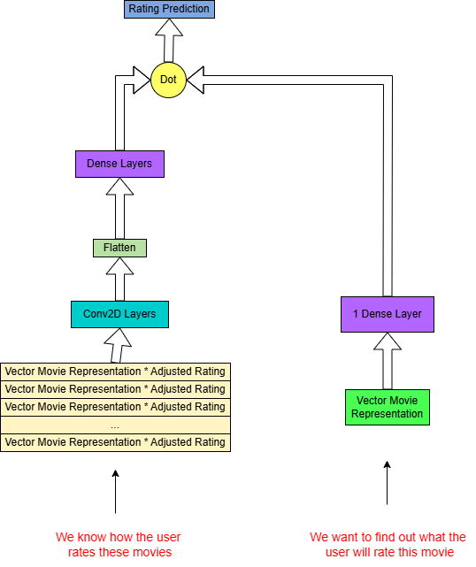

# Screen Genius
> *A Comprehensive Recommender System Using Netflix Prize Data*

---

## Table of Contents
1. [Introduction](#introduction)  
2. [Toy Models](#toy-models)  
   - [SVD Model](#svd-model)  
   - [NCF Model](#ncf-model)  
   - [Two-Tower Model](#two-tower-model)  
3. [Data](#data)  
4. [Visualization Notebook](#visualization-notebook)  
5. [Frontend](#frontend)  
6. [Setup and Installation](#setup-and-installation)  
7. [Usage](#usage)  
8. [Project Structure](#project-structure)  
9. [Contributing](#contributing)  
10. [License](#license)  
11. [Contact](#contact)

---

## Introduction
This project presents a **comprehensive recommender system** based on the [Netflix Prize data](https://www.kaggle.com/datasets/netflix-inc/netflix-prize-data). We initially explore three popular approaches to recommendation systems—**Singular Value Decomposition (SVD)**, **Neural Collaborative Filtering (NCF)**, and a **Two-Tower architecture**—as “toy models.”

Building on these, we have developed a **deployed web application** available at https://recsys-41460.web.app/. The user can rate movies and click "Submit" to get personalized recommendations. This process may take some time on the deployed version (as it runs on a CPU on Google Cloud Run), but can run very quickly.  On an M1 Mac, for example, results are generated in about 15 seconds.

The final production model uses a **two-stage Two-Tower approach** to handle cold-start scenarios efficiently:
1. **Model 1**: Produces a 16-dimensional vector for each of the 970 popular movies, using semantic information from the movie title and the movie’s release date.

2. **Model 2**: Takes user ratings for up to 16 movies and constructs a 16×16 2D array by multiplying each selected movie’s 16D vector by the user’s adjusted rating for that movie. This 2D array is then fed into a CNN-based Two-Tower model that outputs a user embedding.

If a user rates more than 16 movies, 16 are randomly chosen. If fewer than 16 are rated, the blank spaces are filled with zeros.  This ensures that user side input to model 2 is always shape 16x16.

Once the user embedding is generated, it is used to predict scores for all 970 movies. The system responds with the top 10 highest predicted ratings and the 10 lowest predicted ratings, displayed to the user via a **Vite + React** frontend.

We provide the entire pipeline—from data visualization and exploration, to model building and training, to deployment in a Docker container on Google Cloud Run with a **FastAPI** backend, to a **Firebase**-hosted frontend.

---

## Toy Models

### SVD Model
- **Description**: Implements a matrix-factorization approach using the Surprise library.
- **Notebook**: [SVD.ipynb](toy_models/svd/svd.ipynb)
- **Features**:
  - Learns latent factors from user-item interactions.
  - Scalable solution for large rating matrices.
  - Supports user-based and item-based predictions.

### NCF Model
- **Description**: Implements an NCF model using the LibRecommender library.
- **Notebook**: [NCF.ipynb](toy_models/ncf/ncf.ipynb)
- **Features**:
  - Best Performance of the 3 toy models.
  - Easy to incorporate additional features like user demographics or item metadata.

### Two-Tower Model
- **Description**: A neural network approach that learns separate embeddings for users and items (two towers) before combining them through a similarity measure (dot product).
- **Notebook**: [TwoTower.ipynb](toy_models/two_tower/two_towers.ipynb)
- **Features**:
  - Highly scalable for large-scale recommendations.
  - Allows flexible training objectives (e.g., maximizing dot-product similarity for relevant user-item pairs).
  - Easy to deploy for real-time recommendations.

---

## Data
- **Source**: [Netflix Prize data](https://www.kaggle.com/datasets/netflix-inc/netflix-prize-data)
- **Description**: The dataset contains user ratings for various movies. It consists of several million ratings, making it ideal for testing the performance and scalability of recommender systems.
- **Usage**:
  - **Ensure** you have downloaded and extracted the dataset locally or in your Google Drive (if running on Colab).
  - **Path updates**: Modify the data paths in the notebooks to point to the directory where you’ve stored the files.

*Note*: The dataset usage must comply with its [license and terms](https://www.kaggle.com/datasets/netflix-inc/netflix-prize-data/rules).

---

## Visualization Notebook
- **Notebook**: [Visualization.ipynb](data_visualization.ipynb)
- **Features**:
  - Exploratory Data Analysis (EDA) for user rating distributions, movie popularity trends, etc.

---

## Frontend
- **Description**: A **Vite + React** frontend that allows users to rate movies and submit their ratings. The system then returns recommendations based on a CNN-based Two-Tower model.
- **Features**:
  - Users can browse or search for movies from the set of 970 popular titles.
  - When users click "Submit," their ratings are sent to the FastAPI backend for inference.
  - The backend responds with the **top 10 highest** predicted ratings and the **10 lowest** predicted ratings for that user.
  - Results are displayed on the frontend.
- **Deployment**:
  - Hosted on **Firebase** at https://recsys-41460.web.app/.
  - Model inference is performed on a **CPU on Google Cloud Run**, so the recommendation process can take up to a 90 seconds.  
  - On an **M1 Mac**, the predictions typically take around 15 seconds.

---

## Setup and Installation

1. **Clone the Repository**  
   git clone https://github.com/yourusername/recommender-system.git  
   cd recommender-system

2. **Install Dependencies**  
   - **Option A**: Using pip  
     pip install -r requirements.txt

   - **Option B**: Using conda  
     conda create -n recsys_env python=3.8  
     conda activate recsys_env  
     pip install -r requirements.txt

3. **Acquire Dataset**  
   - Download the Netflix Prize data from https://www.kaggle.com/datasets/netflix-inc/netflix-prize-data.
   - Place the extracted files in a `data` folder or update paths in the notebooks accordingly.

4. **Google Colab** (Optional)  
   - Upload the notebook(s) to your Google Drive or open directly from GitHub.
   - Make sure to mount your Drive:
     from google.colab import drive  
     drive.mount('/content/drive')

   - Update file paths in the notebooks to reference the dataset in your Drive.

---

## Usage

1. **Run the Toy Model Notebooks**  
   - Open each notebook (SVD, NCF, Two-Tower) inside the `toy_models` folder and run cell by cell.
   - Ensure that the required Python libraries (listed in `requirements.txt`) are installed.

2. **Data Visualization**  
   - Open the visualization notebook (e.g., `data_visualization.ipynb` in the root directory).
   - Run the analysis cells to explore data distributions, user ratings, and more.

3. **Build and Train the Production Model**  
   - Inside the `src` folder:
     - get_embeddings.ipynb: Trains the first Two-Tower model to generate 16D movie embeddings (based on title semantics and release date).
     - build_model.ipynb: Uses the saved 16D movie embeddings and constructs the CNN-based user tower. This notebook outputs the final model file (.h5 or similar) used in deployment.

4. **Docker & FastAPI Deployment**  
   - The `docker` folder contains:
     - Dockerfile: Defines the container environment.
     - main.py: FastAPI application serving the model.
   - To build and run locally:
     cd docker  
     docker build -t your_docker_image_name .  
     docker run -p 8000:8000 your_docker_image_name

   - Deployed on **Google Cloud Run**. The containerized FastAPI app receives user ratings, runs the model inference, and returns the recommendations.

5. **Frontend**  
   - Located in the `frontend` folder.
   - Built with **Vite + React**.  
   - Deployed to **Firebase** at: https://recsys-41460.web.app/.
   - When the user rates movies and clicks "Submit," it sends a POST request to the FastAPI endpoint.  
   - The server returns:
     - Top 10 highest predicted ratings.
     - 10 lowest predicted ratings.
   - The frontend displays these results to the user.

6. **Using the Web App**  
   - Go to https://recsys-41460.web.app/.
   - Rate some movies from the list (up to 16 will be used in creating the user embedding).
   - Click “Submit.”
   - Wait for the model to process (may take up to a minute on CPU).  
   - View the recommended highest- and lowest-rated movies.

---

## Project Structure
Below is a representative layout of the project’s files and directories:

    recommender-system/
    │
    ├── data/
    │   └── ... (Netflix Prize data files)
    │
    ├── toy_models/
    │   ├── SVD.ipynb
    │   ├── NCF.ipynb
    │   └── TwoTower.ipynb
    │
    ├── src/
    │   ├── get_embeddings.ipynb  (generates 16D movie vectors)
    │   └── build_model.ipynb     (builds CNN-based Two-Tower model)
    │
    ├── docker/
    │   ├── Dockerfile  (for the FastAPI container)
    │   └── main.py     (FastAPI API code)
    │
    ├── frontend/
    │   ├── ...         (Vite + React files)
    │   └── ...
    │
    ├── data_visualization.ipynb  (root-level EDA and visualization file)
    ├── requirements.txt
    ├── README.md
    └── LICENSE

- **data/**: Folder for the Netflix Prize data.
- **toy_models/**: Contains the “toy” notebooks for SVD, NCF, and a simple Two-Tower model.
- **src/**: Contains the notebooks for generating movie embeddings (get_embeddings.ipynb) and building the final CNN-based Two-Tower model (build_model.ipynb).
- **docker/**: Holds the Dockerfile and main.py (FastAPI API) for containerization and deployment on Google Cloud Run.
- **frontend/**: Contains the Vite + React code deployed to Firebase.
- **data_visualization.ipynb**: A root-level notebook for data exploration and plotting.
- **requirements.txt**: Python dependencies.
- **LICENSE**: Project license.

---

## Contributing
Contributions to this project are welcome! Whether it’s improving documentation, adding new features, or fixing bugs:

1. Fork the repository:
   git clone https://github.com/yourusername/recommender-system.git

2. Create a new branch:
   git checkout -b feature/new-feature

3. Commit your changes:
   git commit -m "Add a new feature"

4. Push to the branch:
   git push origin feature/new-feature

5. Create a Pull Request in this repository.

---

## License
This project is licensed under the [MIT License](LICENSE). Please review the license file for more information.

---

## Contact
For questions, feedback, or collaboration, please reach out via [nicholasallison341@gmail.com](mailto:nicholasallison341@gmail.com) or open an [issue](https://github.com/nick-allison/RecSys/issues) on GitHub.

---

**Happy Recommending!**  
*Thank you for checking out this project. We hope it provides a valuable starting point for your own recommender system endeavors.*
